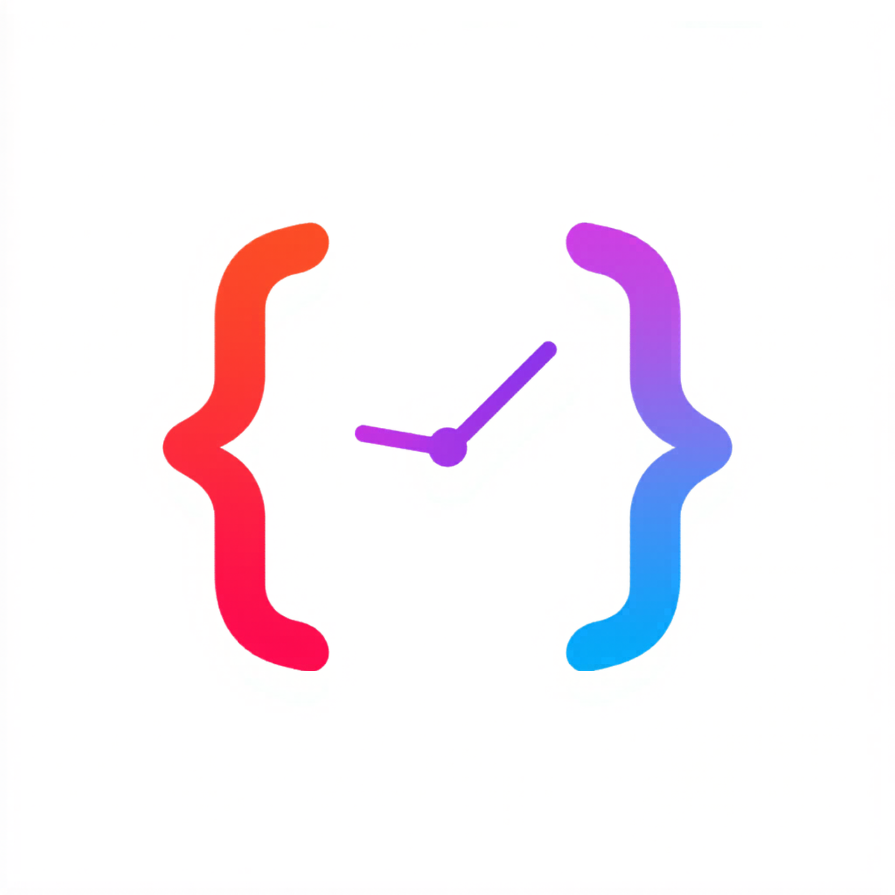
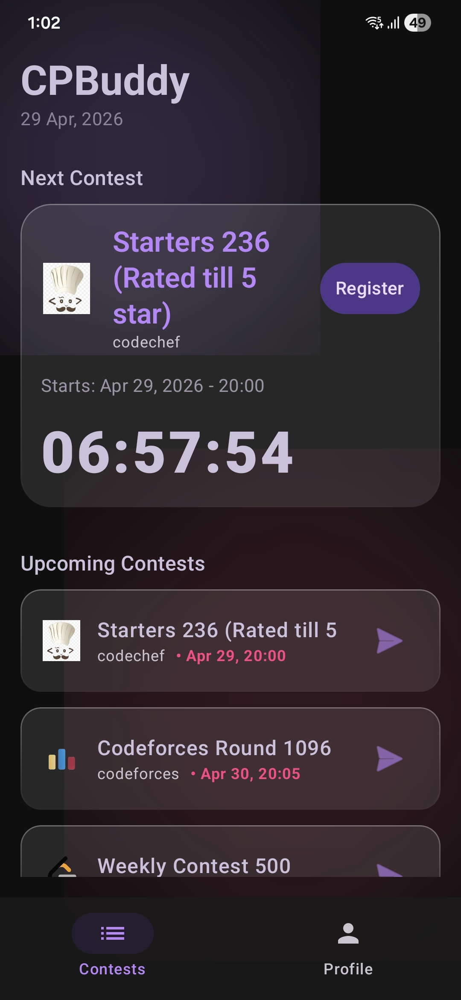
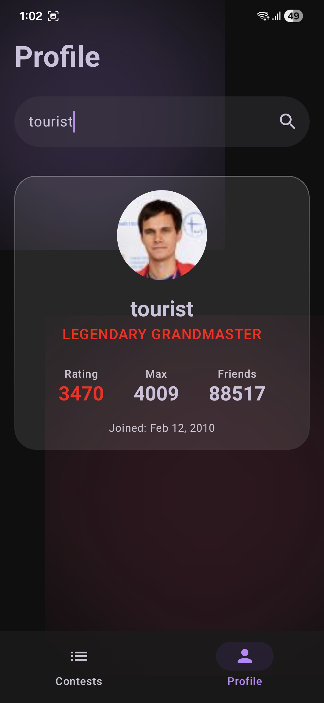

<div align="center">

  

  <h1>CPBuddy</h1>

  <p align="center">
    <strong>The ultimate companion for competitive programmers.</strong>
    <br />
    <em>Track contests, analyze profiles, and stay ahead of the curve with a stunning Glassmorphic interface.</em>
  </p>

  <p align="center">
    <a href="#-features"><b>Features</b></a> •
    <a href="#-showcase"><b>Showcase</b></a> •
    <a href="#-tech-stack"><b>Tech Stack</b></a> •
    <a href="#-getting-started"><b>Download</b></a> •
    <a href="https://github.com/yourusername/CPBuddy/issues"><b>Support</b></a>
  </p>

  <div align="center">
    
    
    
    
    
  </div>
  
  <br />
</div>

<hr />

**CPBuddy** isn’t just another contest tracker. It’s a precision tool designed for developers who live and breathe competitive programming. Built from the ground up with a focus on performance and aesthetics, it brings all your contest data into one beautiful, immersive experience.

---

## 📸 Showcase

<div align="center">
  
  
</div>

---

## ✨ Features

<div align="center">

<table>
  <tr>
    <td width="50%" valign="top">
      <div align="left">
        <h3>🏆 Contest Tracking</h3>
        <ul>
          <li>Real-time updates from <b>Codeforces</b>, <b>CodeChef</b>, and <b>LeetCode</b>.</li>
          <li>Featured "Next Contest" card with live countdown.</li>
          <li>Direct registration links to keep you fast.</li>
        </ul>
      </div>
    </td>
    <td width="50%" valign="top">
      <div align="left">
        <h3>📊 Analytics</h3>
        <ul>
          <li>Deep-dive into <b>Codeforces</b> user stats.</li>
          <li>Color-coded rank indicators and rating history.</li>
          <li>Contribution tracking and user details at a glance.</li>
        </ul>
      </div>
    </td>
  </tr>
  <tr>
    <td width="50%" valign="top">
      <div align="left">
        <h3>💎 Glassmorphism UI</h3>
        <ul>
          <li>Signature blurred backgrounds and sleek transitions.</li>
          <li>Modern Material 3 components.</li>
          <li>Immersive experience that feels "alive".</li>
        </ul>
      </div>
    </td>
    <td width="50%" valign="top">
      <div align="left">
        <h3>🚀 Performance</h3>
        <ul>
          <li>Built with Kotlin Coroutines for buttery smooth UI.</li>
          <li>Efficient image loading with Coil.</li>
          <li>Lightweight and optimized for modern Android.</li>
        </ul>
      </div>
    </td>
  </tr>
</table>

</div>

---

## 🛠 Tech Stack

<div align="center">

| Category | Tools & Libraries |
| :--- | :--- |
| **UI Framework** | [Jetpack Compose](https://developer.android.com/jetpack/compose) |
| **Architecture** | MVVM with Clean Architecture principles |
| **Networking** | [Retrofit 2](https://square.github.io/retrofit/) + GSON |
| **Concurrency** | [Kotlin Coroutines](https://kotlinlang.org/docs/coroutines-overview.html) & Flow |
| **Image Loading** | [Coil](https://coil-kt.github.io/coil/) |
| **Navigation** | Jetpack Navigation Compose |
| **Theming** | Material 3 (M3) with Custom Glass Components |

</div>

---

## 🚀 Getting Started

### Prerequisites
- Android Studio (Ladybug or newer)
- JDK 17+
- Android SDK (API 36)

### Installation
1. **Clone the repository**:
   ```bash
   git clone https://github.com/yourusername/CPBuddy.git
   ```
2. **Open & Sync**: Open the project in Android Studio and let Gradle sync.
3. **Run**: Connect your device and hit **Run**!

---

## 📈 Roadmap
- [ ] **Push Notifications**: Never miss a contest registration deadline.
- [ ] **Calendar Sync**: Add contests directly to your Google Calendar.
- [ ] **Expanded Support**: Add LeetCode and CodeChef profile analytics.
- [ ] **Offline Mode**: Cache data with Room for viewing on the go.

---

## 🤝 Contributing

Contributions are what make the open-source community such an amazing place to learn, inspire, and create. Any contributions you make are **greatly appreciated**.

1. Fork the Project
2. Create your Feature Branch (`git checkout -b feature/AmazingFeature`)
3. Commit your Changes (`git commit -m 'Add some AmazingFeature'`)
4. Push to the Branch (`git push origin feature/AmazingFeature`)
5. Open a Pull Request

---

## 🙏 Acknowledgments

We stand on the shoulders of giants:
- **[CompeteAPI](https://github.com/ravibabuvadde/competeapi)** for the amazing contest data provider.
- **[ravibabuvadde](https://github.com/ravibabuvadde)** for his work on competitive programming APIs.
- The **Material Design** team for the M3 spec.

<div align="center">
  <p><b>If CPBuddy helped you win your next contest, please consider giving us a ⭐</b></p>
  <br />
  
</div>
